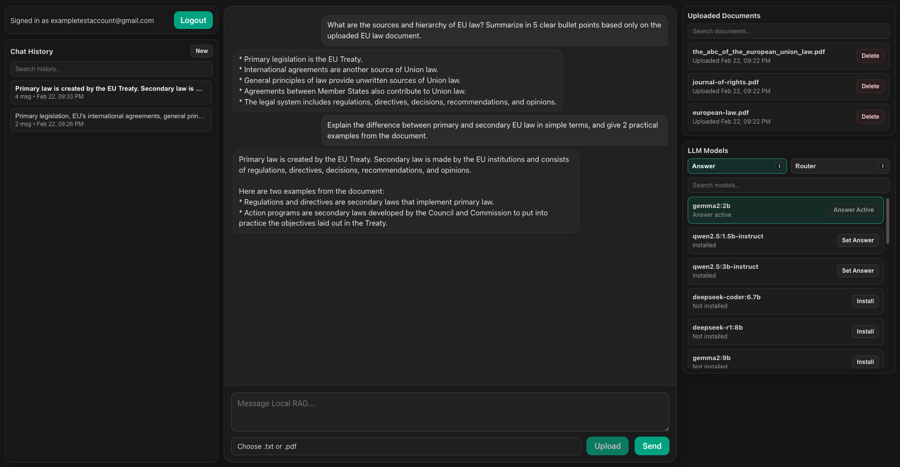

# self-hosted-rag-studio

Local-first RAG chatbot platform built with FastAPI, PostgreSQL/pgvector, Ollama, and React.

This project lets users upload documents, index them, retrieve relevant chunks with hybrid search, and chat with an LLM using grounded context.

## Demo



## What You Can Do

With the current project, users can:

- Create an account and login (`JWT` access + refresh tokens).
- Upload `.txt` and `.pdf` files.
- Automatically chunk and embed uploaded documents.
- Search their own data with:
  - full-text search (`FTS`)
  - vector search
  - hybrid search (`FTS + vector + RRF`) in Postgres
- Chat with a local LLM through `/chat`.
- Continue past conversations (stored in DB).
- Search conversation history with trigram similarity.
- Manage LLM models from UI:
  - list allowed models
  - see installed models
  - pull/install via Ollama
  - choose Answer model and Router model
- Manage their documents from UI:
  - list uploaded documents
  - soft-delete documents

## Architecture

Core components:

- **API (`api/`)**: FastAPI backend (auth, ingestion, retrieval, generation, model management)
- **DB (`postgres + pgvector`)**: document/chunk storage, `tsvector` search, vector search, chat history
- **Ollama**: local embeddings + local generation
- **Frontend (`frontend/`)**: React UI for auth, chat, docs, and model controls

## Tech Stack

- FastAPI
- asyncpg
- PostgreSQL 16 + `pgvector` + `pg_trgm`
- Ollama
- React + Vite
- dbmate migrations

## Quick Start

### Prerequisites

- Docker + Docker Compose
- Node.js 20+

### 1) Start backend services

```bash
docker compose up -d --build
```

Services:
- `postgres`
- `ollama`
- `api`

### 2) Apply migrations

```bash
scripts/dbmate.sh up
```

### 3) Start frontend

```bash
cd frontend
npm install
npm run dev
```

URLs:
- Frontend: `http://localhost:5173`
- API: `http://localhost:8000`
- Swagger UI: `http://localhost:8000/docs`

## Environment Variables

Main variables used by API:

- `DATABASE_URL`
- `OLLAMA_BASE_URL`
- `EMBEDDING_MODEL`
- `EMBEDDING_BATCH_SIZE`
- `JWT_SECRET`
- `JWT_ALG`
- `ACCESS_TOKEN_EXPIRE_MIN`
- `REFRESH_TOKEN_EXPIRE_DAYS`

Optional tuning variables:
- Chunking: `CHUNK_SIZE_CHARS`, `CHUNK_OVERLAP_CHARS`, `CHUNK_MIN_CHARS`, `CHUNK_LANGUAGE`, `CHUNK_USE_SPACY`
- Generation: `GENERATION_TIMEOUT_S`, `GENERATION_TEMPERATURE`, `GENERATION_TOP_K`, `GENERATION_CONTEXT_CHARS_PER_CHUNK`, `GENERATION_HISTORY_MESSAGES`, `GENERATION_MAX_OUTPUT_TOKENS`, `GENERATION_ROUTE_TIMEOUT_S`, `GENERATION_ROUTE_MAX_OUTPUT_TOKENS`
- Model fallback defaults: `GENERATION_MODEL`, `GENERATION_ROUTER_MODEL`

## API Overview

All endpoints except `/`, `/health`, `/auth/*` require:

```http
Authorization: Bearer <access_token>
```

### Health

- `GET /`
- `GET /health`

### Auth

- `POST /auth/register`
- `POST /auth/login`
- `POST /auth/refresh`
- `POST /auth/logout`
- `GET /auth/me`

### Ingestion

- `POST /documents` (upload `.txt`/`.pdf`, chunk, store, background embed)
- `GET /documents` (list current user documents)
- `DELETE /documents/{document_id}` (soft-delete document)
- `POST /documents/{document_id}/embed` (manual embedding trigger)

### Retrieval

- `GET /search`
- `GET /search/vector`
- `GET /search/hybrid`

### Generation

- `POST /chat`
- `GET /conversations`
- `GET /conversations/{conversation_id}/messages`

### Model Management

- `GET /models/available`
- `GET /models/installed`
- `GET /models/config`
- `GET /models/active`
- `POST /models/pull`
- `POST /models/generation`
- `POST /models/router`
- `POST /models/active` (compat alias for generation model)

## Database Tables (Current)

- `users`
- `refresh_tokens`
- `documents` (includes `user_id`, `deleted_at`)
- `chunks` (includes `embedding vector(768)`, `tsv`)
- `conversations` (includes `user_id`)
- `messages`
- `llm_models`
- `model_settings`
- `schema_migrations`

Extensions:
- `vector`
- `pg_trgm`

## Project Structure

```text
api/
  auth/            auth module (router/service/repository/security)
  core/            DB + Ollama client
  ingestion/       upload, extraction, chunking, embeddings
  retrieval/       FTS/vector/hybrid retrieval
  generation/      chat flow + history
  models/          model allowlist/install/select config
  main.py

frontend/
  src/App.jsx      main UI
  src/App.css      UI styles
  src/main.jsx

db/
  migrations/      dbmate migrations
  schema.sql       generated schema snapshot

scripts/
  dbmate.sh
```

## Example Requests

### Register

```bash
curl -s http://localhost:8000/auth/register \
  -H "Content-Type: application/json" \
  -d '{"email":"test@example.com","password":"StrongPass123!"}' | cat
```

### Upload a Document

```bash
curl -s http://localhost:8000/documents \
  -H "Authorization: Bearer <ACCESS_TOKEN>" \
  -F "file=@data/superlig.txt;type=text/plain" | cat
```

### Ask a Question

```bash
curl -s http://localhost:8000/chat \
  -H "Authorization: Bearer <ACCESS_TOKEN>" \
  -H "Content-Type: application/json" \
  -d '{"question":"Who is first in the Super Lig table?","top_k":5,"debug":false}' | cat
```
